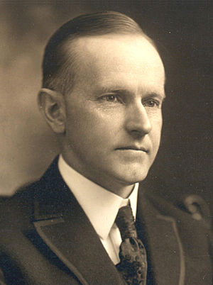
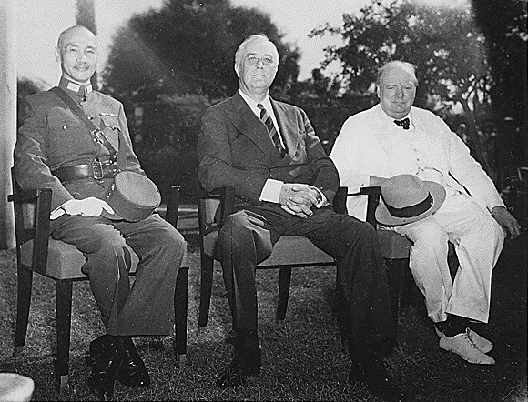
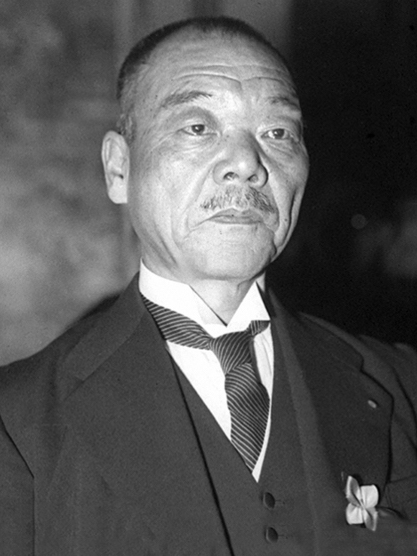

# 昭和前半
## 大正時代の宿題
大正時代からの宿題として、「戦後恐慌・震災恐慌」「普通選挙の実施」がある。 
昭和の初期は、恐慌対策と普通選挙の実施から始まる。

## 昭和前半を4分割
昭和の前半は以下の4分割で整理しよう。 
* 恐慌
* 普通選挙
* 軍部の暴走
* 第二次世界大戦

 

**＜恐慌＞** 
大正時代の恐慌を引継ぎ、1927年に金融恐慌が起きる。1929年には世界恐慌のあおりを受け、昭和恐慌が引き起こされる。 

**＜普通選挙＞** 
1928年に男子普通選挙が実施されるも、予想外の進出を示した無産政党や日本共産党に対する弾圧を強化し、三・一五事件(1928)や四・一六事件(1929)が起きる。

**＜軍部の暴走＞** 
その頃、中国では関東軍が満州某重大事件(1928)を起こし、1931年には柳条湖事件をきっかけに満州事変が勃発した。 
1932年には五・一五事件、1936年には二・二六事件が起き、軍部の暴走が続く。 

**＜第二次世界大戦＞** 
そして、1937年の盧溝橋事件から日中戦争が始まる。1941年には真珠湾攻撃から太平洋戦争が勃発してしまう。 
 
 

## 第一次若槻礼次郎内閣 1926-1927 立憲民政党
1926年 

**＜第一次若槻礼次郎内閣組閣＞** 

**＜取り付け騒ぎ＞** 帝国議会で大蔵相の片岡直温が「東京渡辺銀行がとうとう破綻致しました。」と失言してしまう。そこから、取り付け騒ぎが起きる。 取り付け騒ぎとは、銀行が破綻し、預金が引き出せなくなることを恐れた人が、銀行に殺到することである。 ※写真は銀行に殺到する人々

 

**＜総辞職＞**
 その影響を受け、鈴木商店が倒産し、鈴木商店に融資していた台湾銀行が休業してしまう。若槻内閣は緊急勅令で台湾銀行を救済しようとするも、枢密院の反対で断念。総辞職することに。
 
 

## 田中義一内閣 1927-1929 政友会
1927年

**＜モラトリアム＞**
 台湾銀行救済法案が通常法案で通過する。また、高橋是清大蔵相が3週間の支払猶予令（モラトリアム）を緊急勅令で発令。恐慌は収束していく。 右：田中義一首相 左：高橋是清大蔵相 

 

**＜山東出兵＞**
 満蒙の利権を死守するために、3度に及ぶ山東出兵を実行する。同時に、東京で東方会議を開き、中国政策の方針を定める。

 

**＜ジュネーブ海軍軍縮会議＞**
 米大統領クーリッジがジュネーブ海軍軍縮会議を提唱。補助艦制限について討議するも、英米の対立で決裂する。
 

 
1928年

**＜普通選挙実施＞**
 1925年の普通選挙法にもとづき、第一回普通選挙が実施される。無産政党から山本宣治や鈴木文治など8人が当選する。 しかし、政府や社会主義者・共産主義者を弾圧する。三・一五事件で日本共産党員を大量検挙する。そして、治安維持法を改正し、国体の変革を目的とする結社・組織した人の最高刑が死刑となった。

 

**＜満州某重大事件＞**
 その頃、中国の奉天郊外で満州軍閥の張作霖が爆殺される。俗にいう満州某重大事件である。これは、関東軍参謀河本大作の陰謀であったとされる。張作霖の息子の張学良は国民政府と合体し、事態の鎮圧を図った。

1929年

**＜四・一六事件＞**
 四・一六事件が起き、共産党員の鍋山貞親・佐野学らが検挙される。これにより、共産党は壊滅状態に陥る。獄中で転向声明を出す。 ※写真は1948年時の鍋山貞親

 

**＜総辞職＞**
 満州某重大事件の報告に対し、昭和天皇が不信感をあらわに。田中義一は涙を流し、総辞職を決意した。前年には、短刀で暴漢に襲われるなど、何かと不運に見舞われる。様々な気苦労の影響か、持病であった狭心症により、1929年10月に死去。昭和天皇は、このことに思い悩み、政治に口出しすることを控えるようになる。 ※写真は勅任式の田中義一

 
 

## 浜口雄幸内閣 1929-1931 立憲民政党
1930年

**＜浜口内閣組閣＞** 財務大臣に井上準之助を起用し、外務大臣に幣原喜重郎を起用した。この2人を起用したことにより、浜口内閣は大きな混乱を生むことになる。 ※写真は浜口雄幸

 

**＜金輸出解禁＞**
 浜口と井上蔵相は、「金解禁」「産業合理化」「緊縮財政」を柱にした。特に、金解禁(1930)で金本位制の復帰を行い、貿易拡大を狙った。しかし、結果的に世界恐慌の影響をモロに受け、昭和恐慌が引き起こされた。  恐慌の結果、ドイツではナチス、イタリアではファシズムが台頭する。「それに対抗するためには、満州を死守することが大事」という論調が軍部で拡がっていく。第二次世界大戦時の悪の枢軸国であった、ドイツ・イタリア・日本の暴走は恐慌が遠因ともいえる。 ※写真は井上準之助蔵相

 

**＜ロンドン海軍軍縮条約＞** 外交では、政友会の反対を無視し、ロンドン海軍軍縮条約(1930)を結ぶ。これにより、主力艦建造凍結が1936年まで延長され、補助艦の保有量の制限された。また、大型巡洋艦は対米6割、補助艦対米7割となった。全権は若槻礼次郎と財部彪海相であった。  ロンドン海軍軍縮条約は統帥権干犯問題に発展する。統帥権とは、大日本帝国憲法において、軍隊を指揮する最高の権限のことである。海軍の反対を押し切って、海軍軍縮条約を結ぶことは越権行為と浜口内閣は批判された。その結果、浜口雄幸は東京駅で狙撃され重傷を負う。これがきっかけで、浜口内閣は総辞職。その4か月後に浜口は死去した。平和を願い、海軍軍縮を押し切った浜口は不運の最期を遂げる。

 
 

## 第二次若槻礼次郎内閣 1931 立憲民政党
1931年

**＜第二次若槻内閣組閣＞** 混乱の中、若槻礼次郎は再び首相となる。しかし、組閣から5ヶ月後に満州事変が起こってしまう。二度目の若槻内閣は、軍部への対策に終始することになる。 ※写真は若槻礼次郎

 

**＜満州事変＞** 中国の遼東半島や満州に駐留していた関東軍が、柳条湖で鉄道を爆破する「柳条湖事件」を起こす。当初、中国軍の犯行であると発表されたが、実際には関東軍による自作自演であった。首謀者は関東軍作戦参謀の石原莞爾と板垣征四郎であった。 石原莞爾は後に、「世界最終戦論」という書物を残す。そこには、航空機や大量破壊兵器による殲滅戦争が起こることが予言されていた。石原莞爾は、「その最悪の未来を阻止するためには中国を支配しアジアが一致団結して米国に対抗する必要がある」と考えて満州事変を起こした。 関東軍は、治安維持を名目に、軍事行動を開始。中国の大部分を占領した。若槻内閣は不拡大方針を取ったが、朝鮮軍司令官の林銑十郎が独断で中国に増援を送る。軍部をおさえることもできず、若槻内閣は総辞職するしかなかった。 ※写真は爆破された柳条湖の鉄道

 

## 犬養毅内閣 1931-1932 立憲政友会
1931年

**＜金輸出再禁止＞** 犬養毅と高橋是清蔵相はすぐに金輸出再禁止を行う。立憲民政党が進めていたデフレ政策をインフレ政策に転換する。 ※写真は犬養毅

 

1932年

**＜血盟団事件＞** 血盟団と呼ばれる集団が井上準之助と団琢磨を暗殺する血盟団事件が起きる。血盟団は井上日召が組織した右翼団体。実際には、彼らの集団に組織名は存在せず、名前を付けることを拒みさえしていた。血盟団という名前は新聞がつけた俗称である。 ※写真は法廷で笠を被る血盟団事件の被告人たち

 

**＜リットン調査団＞** 国際連盟からリットン調査団が派遣される。英米仏独伊の五か国によって柳条湖事件や満州を調査することに。

 

**＜満州国建国＞** 関東軍は溥儀を執政とし、満州国を建国。関東軍の軍事行動が「満州国の独立の支援」という大義名分を掲げた。さらに、「五族協和」「王道楽土」をスローガンに、満州国建国の妥当性を主張した。しかし、犬養毅内閣の日本政府は承認しなかった。

 

**＜五・一五事件＞** 海軍の青年将校たちが、総理官邸を襲撃し、犬養毅を殺害した。これをきっかけに、衆議院第一党の党首が総理大臣になるという「憲政の常道」「政党内閣」が終焉を迎えることになる。これより先は軍人が総理大臣になることが増えていく。こうして、民主主義が滅び、軍部の暴走がさらに加速していく。

 

## 斉藤実内閣 1932-1934 海軍

## 岡田啓介内閣 1934-1936 海軍

## 宇垣一成内閣 -

## 林銑十郎内閣 1937 陸軍

## 第一次近衛文麿内閣 1937-1939

## 犬養毅内閣 1931-1932 立憲政友会

## 平沼騏一郎内閣 1939

## 阿部信行 1939-1940

## 米内光政内閣 1940

## 第二次近衛文麿内閣 1940-1941

## 第三次近衛文麿内閣 1941-1941

 

## 東条英機内閣 1941-1944 陸軍
1941年

**＜東条英機内閣組閣＞** 
陸相と内相を兼任した東条英機内閣が発足する。米の国務長官ハルによる最後通牒であるハル・ノートが提示される。御前会議にて、米・英・蘭に対する開戦が決定する。

 

**＜太平洋戦争開戦＞** 
山本五十六司令官による真珠湾攻撃が実施される。同時に、マレー半島にも上陸。太平洋戦争が始まる。

 

1942年 

**＜ミッドウェー海戦＞** 
ミッドウェー海戦で壊滅的敗北。赤城・加賀・飛龍・蒼龍などの連合艦隊主力空母4隻を失う。

 

↑　2020年公開の映画「ミッドウェイ」。真珠湾攻撃の奇襲からミッドウェー海戦での敗北までを丁寧に描く。 ※画像をクリックで予告映像が見れます。

 

1943年 

**＜大東亜会議＞** 
大東亜会議が開かれ、日本史は以下の列国代表が東京に集結。大東亜共同宣言を採択。

 

**＜カイロ会談＞** 
米・英・中がカイロ会談を開く。第一次大戦以降の日本が獲得した領土(太平洋地域・満州・台湾)の返還、朝鮮の独立を宣言。

 
1943年 

**＜サイパン島陥落＞** 
マリアナ沖海戦で日本敗北。絶対国防圏のサイパン島陥落。以後、米軍はサイパン島を日本を爆撃する拠点とする。

 

## 小磯国昭内閣 1944-1945 陸軍
1944年 

**＜小磯国昭内閣組閣＞** 
本土への空襲が激化し、学童疎開が開始される。レイテ島沖海戦で日本敗北。神風特攻隊・人間魚雷回天が出撃する。

 
1945年 

**＜ヤルタ会談＞** 
ウクライナのリヴァディア宮殿で英米ソでヤルタ会談が開かれる。ソ連の対日参戦と千島・樺太の領有が了承させる。

 

**＜本土決戦へ＞** 
硫黄島の玉砕、東京大空襲、沖縄戦と太平洋戦争が激化する。

 

## 鈴木貫太郎内閣 1945 海軍
1945年 

**＜鈴木貫太郎内閣組閣＞** 
5月に同盟国ドイツが降伏。7月には英米中がポツダム宣言を出すが、日本は無視する。そして、8月6日に広島に原子爆弾が投下される。8月8日には、ソ連が対日参戦。ソ連軍の捕虜がシベリアに抑留される。その後、8月9日に長崎に原子爆弾が投下される。

 

**＜ポツダム宣言受諾＞** 
御前会議にて、本土決戦が議論されるも天皇の御聖断でポツダム宣言受諾が決定される。8月14日に終戦の詔書が出され無条件降伏が決定される。

 

## 東久邇宮稔彦王内閣 1945
1945年 

**＜東久邇宮稔彦王内閣組閣＞** 
皇族の東久邇宮稔彦王が組閣。近衛文麿が副総理として入閣。

 

**＜降伏文書調印＞** 
米軍艦ミズーリ号上で降伏文書に調印。全権は、重光葵外相と梅津美治郎参謀総長であった。プレス＝コードにより、出版物の事前検閲・GHQに対する批判は禁止された。 日本側は「国体護持（天皇制維持）と「一億総懺悔」を強調。最終的に、GHQの圧力で総辞職することに。

